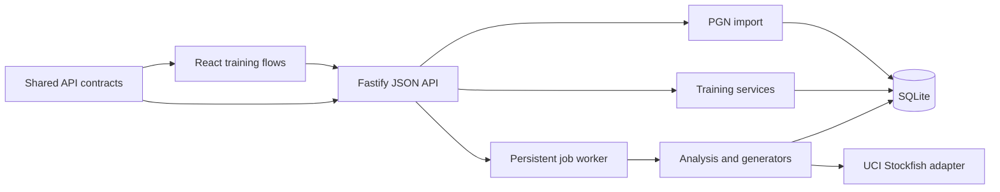

# Architecture and extension guide

Thinking Board is deliberately a small modular monolith: one Node process, one
SQLite database, one React application, and local Stockfish processes. This is
the simplest shape that keeps self-hosting reliable while preserving clear API
boundaries for a future native client.

## Dependency direction

The web application never reads SQLite or invokes Stockfish directly. Analysis
does not know about React. Shared request and response types live in
`packages/contracts`, so another frontend can use the same API.

## Server modules

- `chess/`: PGN parsing and chess-specific input normalisation.
- `imports/`: duplicate-safe persistence and analysis job creation.
- `analysis/`: the UCI boundary, score semantics, meaningful-mistake selection,
  and exercise generators. Engine-specific details stay here.
- `training/`: exercise retrieval and grading, explicit attempt lifecycle,
  player selection, sessions, player metrics, and the shared review scheduler.
- `openings/`: independently authored and privately imported opening curricula,
  PGN variation parsing, provenance metadata, validation, and the compiler that
  turns readable lines into a transposition-aware position graph. Position-level
  review cards, immutable review events and reload-safe queues use a wrapped
  FSRS scheduler. `OpeningGameService` connects real games to that graph using
  the first four FEN fields and persists derived match/departure evidence.
  `OpeningWorkspaceService` projects the graph back into complete named lines
  for browsing without duplicating position identity or memory state, and owns
  mutations to private lines and annotations. `OpeningAnalysisService` uses a
  dedicated one-thread UCI engine and serial queue for interactive sandbox
  requests, keeping them isolated from persistent game-analysis jobs.
  `OpeningExplorerService` and `OpeningCoverageService` access the official
  Lichess Explorer only after an explicit learner action and cache responses for
  seven days. Public
  Lichess Study imports use only validated `https://lichess.org/study/...`
  references and the official PGN export endpoint; preview and chapter
  selection happen before the existing private import pipeline persists data.
  Opening content remains separate from game-derived `training_items`; a focused
  game-deviation review points to the existing opening card instead of creating
  a parallel scheduler.
- `imports/lichess-sync-service.ts`: optional username connection and
  incremental finished-game import through the official Lichess API. Remote
  data passes through the normal PGN validation, duplicate detection and local
  analysis job path; an optional API token is read only from server config.
- `jobs/`: the single persistent analysis worker. A restarted `running` job is
  safely returned to `queued`.
- `db/` and `migrations/`: SQLite ownership. Every schema change is additive and
  versioned; never edit a migration after release.
- `app.ts`: composition root and HTTP translation. Domain decisions belong in a
  service, not in a route handler.

## Web modules

Each training mode remains an explicit component because its teaching sequence
is different. Shared terminology lives in `training-language.ts`, the chessboard
is shared, and empty/due-pool handling uses `TrainingEmptyState`. Do not build a
generic “all-purpose puzzle component”; it would hide the product’s central
distinction between seeing, generating, and checking.

The UI owns presentation state only. Top-level Today, Openings, My games and
Progress routes are hash-backed, so refreshing or sharing a local URL retains
the learner's context. An attempt is created by the server only after the player
presses the mode’s start button. Loading, navigating, pausing or switching a
screen must never count as practice.

The opening studio deliberately separates the authoritative repertoire draft
from the analysis sandbox. Moving on the right board must not mutate saved
content; only the explicit “Add … to my repertoire” action transfers a tested
sequence. Responsive layouts may stack the workspaces, but must retain those
labels and the same save boundary.

## Core invariants

1. Every game, item, session, and dashboard query is scoped to the active player.
2. Reanalysis preserves attempts and review history while replacing generated
   evidence and deactivating stale items.
3. Played-move loss is measured from the same root search as the best move.
   Mate values are not presented as centipawns.
4. Training accepts several engine-supported moves inside the configured
   tolerance; “engine best” is comparison evidence, not a single correct answer.
5. Revealing an answer in a game-derived exercise records a lapse and schedules
   immediate review; an opening demonstration is recorded as assisted and also
   requires a later unassisted recall.
6. No due items is a choice of practice pool, never a dead end. Due review and
   new learning are explicit pools and must not be silently mixed.
7. Opening review is scored as remembered only after an unassisted recall.
   Demonstrated and revealed answers are recorded distinctly, treated as
   assisted, and requeued in the same session, preserving both teaching value
   and scheduling integrity. Slow unassisted recalls remain successful but use
   a shorter interval to build fluency.
8. Opening review identity is one card per profile, repertoire, position and
   knowledge dimension. Content upgrades may change the canonical move without
   discarding the learner's review history.
9. An opening difference is not an engine verdict. Game matching distinguishes
   player departure, opponent departure and exhausted repertoire content; only
   the first case creates a direct recall action.
10. Lines are a human-readable projection over the position graph. Review
    identity remains position-based even when the same move appears in several
    named paths or is reached through a transposition.

## Adding a training mode

1. Add the mode-specific table in a new migration and retain `training_items` as
   the shared identity.
2. Add request/response contracts in `packages/contracts`.
3. Generate only positions supported by reliable evidence. Store that evidence
   so a future detector version can explain or replace the item.
4. Add retrieval, answer, and reveal service methods. Start attempts through
   `AttemptLifecycle` and finish them through the shared review scheduler.
5. Add API routes with validation and active-player scoping.
6. Build an explicit UI sequence with one question at a time, term help, and
   feedback that distinguishes the category, board target, and move.
7. Add a flow test covering load without an attempt, explicit start, answer,
   recorded review state, and the no-due fallback.
8. Add the mode to session weights only after the complete loop works.

## Analysis changes

Increment `ANALYSIS_VERSION` whenever stored assessments or generated evidence
would change. On startup, older games are queued for reanalysis. A generator
must upsert stable item identities, replace generated responses, and preserve
human classifications and training history.

## Scaling path

SQLite and one analysis worker are appropriate for a single household. The
first scaling step is not microservices: split large domain services by
responsibility and add route modules while retaining this dependency direction.
Only consider a server database or separate workers if concurrent authenticated
users become a real requirement.
