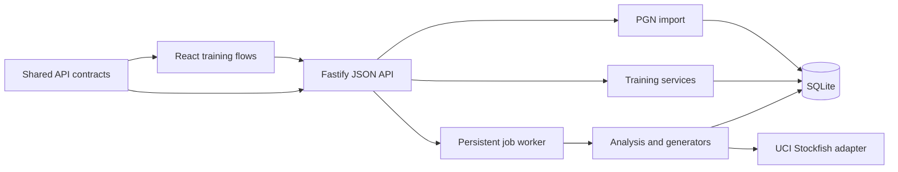

# Architecture and extension guide

Thinking Board is deliberately a small modular monolith: one Node process, one
SQLite database, one React application, and local Stockfish processes. This is
the simplest shape that keeps self-hosting reliable while preserving clear API
boundaries for a future native client.

## Dependency direction

The web application never reads SQLite or invokes Stockfish directly. Analysis
does not know about React. Shared request and response types live in
`packages/contracts`, so another frontend can use the same API.

## Server modules

- `chess/`: PGN parsing and chess-specific input normalisation.
- `imports/`: duplicate-safe persistence and analysis job creation.
- `analysis/`: the UCI boundary, score semantics, meaningful-mistake selection,
  and exercise generators. Engine-specific details stay here.
- `training/`: exercise retrieval and grading, explicit attempt lifecycle,
  player selection, sessions, player metrics, and the shared review scheduler.
- `jobs/`: the single persistent analysis worker. A restarted `running` job is
  safely returned to `queued`.
- `db/` and `migrations/`: SQLite ownership. Every schema change is additive and
  versioned; never edit a migration after release.
- `app.ts`: composition root and HTTP translation. Domain decisions belong in a
  service, not in a route handler.

## Web modules

Each training mode remains an explicit component because its teaching sequence
is different. Shared terminology lives in `training-language.ts`, the chessboard
is shared, and empty/due-pool handling uses `TrainingEmptyState`. Do not build a
generic “all-purpose puzzle component”; it would hide the product’s central
distinction between seeing, generating, and checking.

The UI owns presentation state only. An attempt is created by the server only
after the player presses the mode’s start button. Loading or switching a screen
must never count as practice.

## Core invariants

1. Every game, item, session, and dashboard query is scoped to the active player.
2. Reanalysis preserves attempts and review history while replacing generated
   evidence and deactivating stale items.
3. Played-move loss is measured from the same root search as the best move.
   Mate values are not presented as centipawns.
4. Training accepts several engine-supported moves inside the configured
   tolerance; “engine best” is comparison evidence, not a single correct answer.
5. Revealing an answer records a lapse and schedules immediate review.
6. No due items is a choice of practice pool, never a dead end.

## Adding a training mode

1. Add the mode-specific table in a new migration and retain `training_items` as
   the shared identity.
2. Add request/response contracts in `packages/contracts`.
3. Generate only positions supported by reliable evidence. Store that evidence
   so a future detector version can explain or replace the item.
4. Add retrieval, answer, and reveal service methods. Start attempts through
   `AttemptLifecycle` and finish them through the shared review scheduler.
5. Add API routes with validation and active-player scoping.
6. Build an explicit UI sequence with one question at a time, term help, and
   feedback that distinguishes the category, board target, and move.
7. Add a flow test covering load without an attempt, explicit start, answer,
   recorded review state, and the no-due fallback.
8. Add the mode to session weights only after the complete loop works.

## Analysis changes

Increment `ANALYSIS_VERSION` whenever stored assessments or generated evidence
would change. On startup, older games are queued for reanalysis. A generator
must upsert stable item identities, replace generated responses, and preserve
human classifications and training history.

## Scaling path

SQLite and one analysis worker are appropriate for a single household. The
first scaling step is not microservices: split large domain services by
responsibility and add route modules while retaining this dependency direction.
Only consider a server database or separate workers if concurrent authenticated
users become a real requirement.
